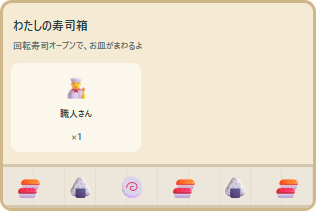
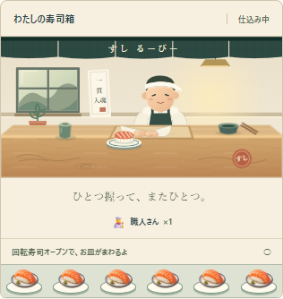

# 最初の職人購入 — 演出の契約

共有された [FunTechの制作記事と体験サイト](https://experience2026.funtech.inc/) を参考に、すしるーぴーの最初の購入を、目に見える店の変化として仕上げる。

## 場面

| きっかけ | はじめ | おわり | 動き・音 |
| --- | --- | --- | --- |
| 開始 | 木のカウンター、道具、お皿 | 職人を迎える準備が整った店 | まだ職人はいない。購入までの案内を静かに表示 |
| 職人を初めて購入 | 誰もいないカウンター | 職人が立ち、最初の寿司を置く | 一度だけ登場。購入音と、既存の音楽のベース追加。画面外なら店を見える位置へ |
| 購入後 | 職人が働く店 | 働き続ける店 | 握る→置く→ひと息、の4拍。音楽ONでは音の時計に合わせる |

## 仕上げの基準

- 紙、藍色、朱色、木の既存の配色に合わせたオリジナルSVG。主役は職人と手元。
- 数量と操作案内は読みやすく。操作を閉じ込める画面や説明ダイアログを追加しない。
- 初回の本物の購入だけ登場する。リロード、Save Code、チェックポイント復元、追加購入では登場を再生しない。
- 音は既存の任意ONを守る。音OFFでも働く動きは見える。
- 端末の動きを減らす設定、手動停止、明示的な再生を尊重する。
- 320 / 390 / 768 / 1024 / 1440pxで表示と購入を確認する。
- 価格、生産量、施設ID、Save v5、1周目の終わりを維持する。

## 検証

`node scripts/craftsman-check.mjs`。既存Chromeを隔離したブラウザcontextで起動し、実際に10回握って購入する。画面と検証結果は `artifacts/craftsman/`。本番ビルドは `SUSHI_TEST_URL` で指定できる。

- 変更前には「最初の購入で職人の絵が現れる」チェックが失敗することを確認。
- 開発版・本番ビルドで5幅の購入、音・動きの設定、再読み込み、追加購入、横はみ出し、実行時エラーを確認。開発版では音と動きの時計の差が60ms未満。
- 1440pxでは最初の購入をキーボードのEnterで実行。
- 既存40テスト、長押し・タッチ・モバイルドック、PC/スマホ幅での同期→崩壊→無言の周回まで成功。
- iPhone実機・Safariは未検証。

| 購入後の変更前 | 職人が働く変更後 |
| --- | --- |
|  |  |
