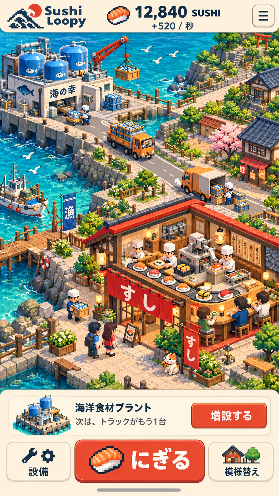

# Sushi Loopy — 育てたことが景色になる箱庭

2026-10-07 企画提案 / 2026-10-08 ユーザー承認により実装。以下は承認時点の企画を保存したもの。実装範囲と検証結果は [箱庭版リリース記録](TOWN_RELEASE_20261008.md) を参照。

## 提案の中心

**一貫握るたび、小さな寿司屋から、海も月も巻き込む「自分の寿司の街」が育つ。**

施設の購入で、新しい仕事、新しい人の動き、新しい遊びが街に加わる。海洋プラントを買うと、そこからトラックが走り、店に食材が届き、客が新しい寿司を食べる。プレイヤーが「自分がこれを動かした」と感じられる因果関係を見せる。

街は見ていて楽しく、触っても楽しく、自分の好みに変えられる。小さな店への愛着を保ったまま、寿司のための設備だけが次第に途方もなくなる。



画像は内蔵 imagegen で生成した方向確認用のコンセプト。稼働画面・完成素材・性能検証結果ではない。数値、ロゴ、購入カードは仮。実際の購入カードには価格を必ず表示する。画像の細かな石や葉は、実機の小画面で主役が埋もれる場合に整理する。

## 確認した現状

- 現行は React / Zustand のクリッカー。施設は9種類。購入、秒間生産、実績、強化、成長する音楽、新聞がある。
- 調査開始時の `SushiBox.tsx` は施設アイコン・所持数・回転レーンが中心。調査中にコード更新があり、最終確認では `SushiCounterArt.tsx` を使う職人の登場・作業演出が加わっていた。本提案はその更新を編集していない。
- 施設同士を結ぶ街・配送経路・模様替えは、確認した画面とコードにはない。
- ローカル稼働画面を390×844のブラウザ表示で確認。上部のロゴ・新聞・操作設定と、大きな寿司画像の後に寿司箱が続く。箱庭の成長を主役にするには、最初の画面から街を見せる構成に変える必要がある。実機iPhoneでの確認ではない。
- 現行の終盤は同期装置から崩壊へ進み、最後の寿司を握ると育成状態を初期化する。Save v5 の `previousRun` に前回の記録が残る。
- 過去のプレイ研究メモにも購入後に残る景色、動き、寿司のドット絵、街への愛着が検討材料としてある。未校正の自動文字起こしを本人の確定発言として引用しない。今回の直接の要望を設計の根拠にする。

確認元: [SushiBox](../src/ui/SushiBox.tsx)、[GameScreen](../src/ui/GameScreen.tsx)、[施設定義](../src/game/data/facilities.ts)、[store](../src/game/state/store.ts)、[Save定義](../src/game/save/types.ts)、[プレイ研究](COOKIE_CLICKER_PLAYTEST_20260911.md)。

## 見た目は「立体的なドットの寿司ジオラマ」

斜め見下ろし、カメラ角度固定の2.5Dを推す。低ポリの読みやすい立体と、ドットの輪郭・手触りを合わせる。街の建物、人、寿司、乗り物を同じ縮尺・光・画素密度で揃える。

- 寿司屋は朱色ののれんと木、海は青緑、工業施設は藍と白。現行の紙色・藍・朱を画面の基調として引き継ぐ。
- 人は小さくても職業と行動がわかる体型。店は一部を切り開き、職人の手元と回転レーンが外から見える。
- 主役は「店」「今回増えた施設」「両者の間の動き」。葉や石や煙を同じ強さで描き込まない。
- 海洋地区が増えても最初の店を見失わない。店が街の中心であり続ける。
- 文字と操作UIは鮮明に描く。小さな日本語までドット化しない。
- 施設の形の違いは、縮小・音OFFでも読める。光沢や派手なエフェクトだけに依存しない。

『ビビッドアーミー』の公式紹介は、施設などの合体強化を特色としている。そこから「強化が目に見える気持ちよさ」を参照し、Sushi Loopyでは購入と増設に結びつける。必須の合体操作を増やす判断は、この提案ではしない。[G123公式紹介](https://g123.jp/game/vividarmy?lang=ja)

## 購入には4つの楽しさを持たせる

| 時間 | プレイヤーが受け取るもの | 海洋プラントの場合 |
|---|---|---|
| 押した瞬間 | 手応えと成立の確認 | ボタンが沈み、購入成功音、水槽の点灯 |
| 数秒後 | 買った理由がわかる出来事 | 初便が出発し、店で荷下ろしする |
| 次に画面を見るとき | 育てた成果が残る景色 | 稼働する水槽、走るトラック、店の新メニュー |
| 自分で触ったとき | 愛着や発見 | 運転手が手を振る、トラックの色を変える |

金額と生産量に加え、購入カードに「次はトラックが走る」「テラス席ができる」など、次の景色を短く予告する。演出は購入成功時だけ。復元やリロードを新規購入として祝わない。

### 海洋プラント初回購入の6秒

時間は演出の設計目標であり、現行の実測値ではない。

| 時点 | 街の変化 |
|---|---|
| 0–0.2秒 | 代金と生産量を確定。押した場所の外側にも小さな反応が出る |
| 0.2–1.2秒 | 水槽に水が入り、ポンプが動き、作業員が持ち場へ走る |
| 1.2–3.5秒 | クレーンが食材箱を積み、最初のトラックが店へ出発 |
| 3.5–5秒 | 店で荷下ろし。職人が新しいネタを握り、皿を置く |
| 5–6秒 | 客が一口食べて喜ぶ。店先に今日のおすすめが残る |
| 以降 | 配送と調理が通常の街の営みとして続く |

入力は止めない。初便を見るために演出終了を待たせない。初回は短い経路で因果を伝え、その後は落ち着いた往復にする。購入後のカメラ移動は最小限で、街をドラッグ中なら奪わない。

**配送は生産量を伝える演出とする。** 経済計算の正しさをトラックの到着に依存させない。アニメーション停止、画面外、低負荷モードでも生産は同じ。初回の寿司納品で通常生産を二重加算しない。回転寿司をまだ持っていなければ、出発時から存在する小さな店へ届ける。

## 既存9施設を、街の9つの変化にする

| 施設 | 初回購入で起こること | 育つと残る変化 | 小さな遊び |
|---|---|---|---|
| 職人さん | 暖簾をくぐり、最初の一貫を握る | 作業台、見習い、道具棚が増える | タップすると包丁をくるり、たまに得意の握り |
| 回転寿司オープン | レーンが回り、最初の客が座る | 席、テラス、客の列、皿の種類が増える | 常連の好きな皿を1回選ぶ |
| 寿司自動握り器 | アームが起動し、最初の皿が飛び出す | 機械と搬送ラインが増え、店に接続する | 三拍子で数回だけお手伝い |
| 海洋食材プラント | 水槽が満ち、トラックの初便が店に届く | 水槽、荷積み場、車庫が育つ | トラックに合図、車体の色替え |
| SUSHI海洋採掘 | 海に採掘場ができ、サーモンの地層を掘り上げる | 掘削機、運搬船、プラントへの荷下ろしが増える | たまに変な寿司鉱石やタコが出てくる |
| 寿司融合発電 | 二つの寿司が炉で重なり、街へ電気が走る | 街灯、店の看板、港の夜景が点く | 発電の拍子に提灯が踊る |
| LUNA_SEA | 小さな発射台から月便が出発する | 月の漁場と地上の受取所が育つ | 宇宙飛行士を触ると低重力で一回転 |
| 鮮度凍結装置 | 限られた区画の水しぶきや魚が空中で止まる | 冷気の庭、氷の寿司彫刻、冷蔵便が増える | 凍った泡を割ると小さな音が鳴る |
| 世界鮮度同期装置 | アンテナから街に波が走る | 普段の動きに少しずつ異常が混じる | 見慣れた配達や常連の「おかしさ」を発見する |

毎施設を同じ建築ポップで済ませない。「人が来る」「回る」「運ぶ」「掘る」「点灯する」「飛ぶ」「凍る」で購入の味を変える。

同じ施設を多数購入したときは、所持数と表示物の数を一対一にしない。例えば1・5・10・25台で外観を段階変化させ、途中の購入でも増設の小演出と生産量の変化を返す。次の外観変化までの残りを購入カードに示す。節目は仮案であり、経済の調整と合わせて試す。同期装置の1・2・3台は現行の物語に合わせた例外。

## 「自分の街」になる選択

自動で賑やかになるだけでは、全員同じ街になる。早い段階で小さな選択を返す。

1. **最初の店に、自分の色をつける。** のれんの色、看板、店名。まず色を選ぶだけでも成立し、名前入力は任意。
2. **施設の場所を選べる。** 港や店の周囲に読みやすい設置区画を用意。初回は自動配置で直ちに働き始め、後から無料で動かせる。
3. **配置で景色が変わる。** 店を海側へ移すと、客が海を見て食べる。ベンチを置くと常連や猫がそこへ来る。
4. **生活の痕跡が増える。** 常連の指定席、職人の湯のみ、今日の仕入れ箱。自分のプレイに応じたものが店に残る。
5. **街を撮れる。** UIを隠して眺め、成長前後を比べられる。共有はプレイヤーが選んだときだけ。

配置による必須の生産ボーナスは当初付けない。「好きな場所に置いたら損をした」を避け、見た目の選択を自由にする。動線は設置区画に応じて自動でつながる。家具で道を塞いでも経済が止まる設計にはしない。

建物を何十棟も縮めて一画面に押し込まず、「お店」「港」「沖合」「月」を読みやすい地区に分けて広げる。最初は店と港だけで十分に見渡せる範囲にする。地区が増えても、下部の「お店へ」で一度で戻れる。

## 箱庭の中の24の小さな遊び

別画面のミニゲーム集にせず、日常の景色から自然に起きるものを中心にする。すべてを初日から出さない。初期実装に選ぶのは下のうち3〜4個で、残りは拡張候補。

### 触るだけで嬉しい

| 案 | 操作と反応 |
|---|---|
| 1. トラックに「いってらっしゃい」 | 一度タップすると短いクラクションと運転手の手振り。連打しても音を重ねすぎない |
| 2. 店先の猫 | タップで伸びる、箱に入る、ベンチへ移る。世話を怠った罰はない |
| 3. 暖簾をくぐる風 | なぞると暖簾が揺れ、奥の職人が見える |
| 4. 職人の隠し技 | 作業の合間に触ると卵焼きをくるり。失敗しても本人が照れるだけ |
| 5. 水槽の魚 | 指の近くに寄って来る。指を置いたままでも遊べる |
| 6. 港のカモメ | タップで飛び立つと、下に小さな落書きや忘れ物が見える |
| 7. 積み上がる皿 | 軽く触るとカラカラと揺れて戻る。壊れて損失が出ることはない |
| 8. 街の拍子 | 発電所・機械・トラックが、それぞれ音楽の異なる拍で動く。音OFFでも見てわかる |

### 3〜10秒だけ手を貸す

| 案 | 操作と結果 |
|---|---|
| 9. 今日のひと皿 | 常連の吹き出しと同じ寿司を、下部の大きな2択から選ぶ。短いお礼と小さなボーナス |
| 10. 初便のお手伝い | 荷物を触ると積み込みが少し賑やかになる。手伝わなくても配達する |
| 11. 三拍子の握り | 大きなボタンを3回、ゆっくりした拍子で押す。上手なら特別な見た目の寿司。難しい連打を要求しない |
| 12. 港の一本釣り | 浮きが沈んだら一度押す。外しても再挑戦でき、進行は止まらない |
| 13. 金のお皿 | 街の一角に時々現れる。見つけると短いお祝い。最初の体験は必ず起こる |
| 14. おまかせ仕込み | 今日の主役のネタを2択で決める。店の皿・看板・客の反応がしばらく変わる |
| 15. 氷の音遊び | 凍結区画の泡を触ると数種類の音。順番を覚えさせる課題は不要 |
| 16. 月からの荷物 | 開けると月の魚・奇妙な土産。まずは見た目の収集として扱う |

### 眺めると気づく・残して嬉しい

| 案 | 起こること |
|---|---|
| 17. いつものお客さん | 好きな席、いつもの寿司、短い台詞がある。新施設を買うと一言が変わる |
| 18. 居場所のある猫 | 置いた座布団やベンチを使う。飾りが暮らしに結びつく |
| 19. 閉店後のまかない | 好きな時間帯に切り替えると、客の席で職人が寿司を食べる |
| 20. 雨の店先 | 雨傘、湯気、車の水しぶき。悪天候で生産が落ちない |
| 21. 開店記念のお祭り | 大きな成長の節目に小さな行列と提灯。見逃しても後から眺められる |
| 22. 新聞が街で起きる | 「配達員、近道を覚える」なら街の配達員が短い芝居をする。記事と景色がつながる |
| 23. 寿司の発見帳 | 食材や特殊な寿司の絵と短い冗談を残す。街の飾りとして置けるものもある |
| 24. 同じ場所からの記念写真 | 店の成長を同じ構図で見返す。最初の小ささが後から効く |

追加報酬を持つ遊びは、自動生産を楽しむ人が置いていかれない強さに調整する。初期の仮上限は、同じ時間の通常プレイ収益に対して合計+10%程度。これは採用済みのバランスでも業界標準でもない。報酬ゼロの愛嬌と、少量の報酬がある遊びを混ぜる。全部を拾う作業にはしない。

収益に関係する注目イベントは同時に1件まで。逃しても常連・お届け箱などで別の機会を作り、タップし続ける義務にしない。発見帳や写真は進捗を遮る通知で毎回開かない。

## スマホ縦持ちの画面と操作

通常画面の目安は「上部8〜10%が残高と毎秒生産」「中央約65〜70%が街」「下部約20〜25%が次の一歩と操作」。端末の安全領域に合わせて調整し、狭い画面では装飾や副情報から整理する。

- **握る:** 下中央の大きなボタン。現行の長押しを引き継ぐ。押すたび街の店で皿が一つ増える、職人が手を動かすなど、手元と街が応答する。
- **設備:** 下から購入シートが開く。初期状態は次の購入が1件だけ見える。必要ならシートを広げて施設一覧を見る。
- **購入:** シート内で買った直後に街の該当箇所が見える。価格、生産の増分、景色の変化を同じカードにまとめる。
- **模様替え:** 「建物を選ぶ→移動先区画をタップ→置く」。取り消しを常に用意。長押しドラッグは任意の近道にする。
- **移動:** 街の空地を一本指でドラッグ。通常タップで施設の説明。回転操作は入れず、拡大はボタンでもできる。
- **お手伝い:** 動く小さな物を追って正確に押させない。対象を選ぶと下部の大きなボタンでも同じ操作ができる。
- **ニュース・記録・設定:** 通常画面で街を押し下げず、必要なときに開ける位置へ。短いニュースは控えめな表示にする。
- **眺める:** UIを隠せる。戻る操作は一度のタップで、迷わせない。

AppleはiPhone/iPadのゲーム操作について、標準のタップ領域として44×44ptを目安にしている。Web版の本案では48×48 CSS px以上、主操作は高さ56〜64 CSS pxを出発点に、実機で調整する。ptとCSS pxを同じ単位として扱わない。主要な説明は読みやすい大きさを維持し、文字を縮めて詰め込まない。[Apple WWDC24](https://developer.apple.com/videos/play/wwdc2024/10085/)

タップ領域が重なる施設は、選択表示と下部の施設一覧で選び直せる。色だけで購入可否を伝えない。購入や配置には名前付きボタンを提供する。音・振動・動きを減らした状態でも、成立と成長がわかるようにする。

## 最初の5分で体験させたいこと

以下は目標の仮説。現在の価格で到達できると検証した時間ではない。特にプラントは現行10,000 SUSHIなので、実プレイで届く時間を測り、必要な場合だけ価格・収益を調整する。

| 時間の目安 | 体験 | 伝えたい感覚 |
|---|---|---|
| 0〜10秒 | 小さな店で一貫握る。手元と店が反応 | 触って気持ちいい |
| 10〜40秒 | 職人を迎え、勝手に寿司ができ始める | 自分が働く場所を作った |
| 40〜90秒 | 回転寿司が開き、客が来る | 買うと世界が変わる |
| 90〜150秒 | のれんの色を選び、常連にひと皿出す | これは自分の店だ |
| 150〜240秒 | 握り器が店につながる。次の港の姿が見える | 次の設備も見たい |
| 240〜300秒 | プラントから初便が届き、街に初めて長い動線ができる | 小さな店が街になった |

最初から説明文や24種類の遊びを並べない。初回の職人、回転レーン、初便は確実に体験できる報酬とし、偶然のレア演出に頼らない。

2回目以降は、30〜60秒でも「街を見る→次の購入→小さな出来事→また眺める」ができる。長く遊ぶ日は増設と模様替えへ。翌日だけに限定するイベントや、連続ログインを前提にした進行はこの案の中心にしない。

## 箱庭への愛着と、現在の周回を両立させる

育てた街があるからこそ、同期装置の異常と崩壊は強くなる。一方、自由配置や収集の手間まで毎回消えると、育てる気持ちを損なう可能性がある。

提案は、経済の周回と「自分らしさ」の保存範囲を分けて設計すること。

| 要素 | 提案する扱い |
|---|---|
| SUSHI、施設所持数、生産設備 | 現行の周回に合わせて初期化 |
| 店名、選んだ色、獲得した装飾の権利 | 周回後も引き継ぐ候補 |
| 前回の街の姿 | 現行の前回記録に、見返せる街の構図を添える候補 |
| 施設の配置 | 未所有の設備を出さず、再購入時に前回の好みの位置を使える候補 |
| 物語の余韻 | 最初の店に同じ猫が戻る、以前の看板に小さな痕跡があるなど |

異常はランダムな画面ノイズより、普段から見てきた営みの変調にする。いつも一周するトラックが同じ場所を二度通る、客が同時に箸を止める、湯気だけが逆流する。見慣れた街があるほど違和感が効く。

これは結末とSave仕様を広げる提案であり、現行の終盤を今回変更するものではない。装飾や街の記録の永続化を採用する段階で、旧セーブ・Save Code・チェックポイントの移行を一緒に設計する。

## 目標品質を、確認できる基準にする

ランキング1位は設計だけでは保証できない。ここでは要求を下げず、作品側で検証できる基準を置く。以下の数値は本作向けの仮基準で、実測・達成済み・業界共通値ではない。

| 観点 | 合格とする状態・確かめ方 |
|---|---|
| 一目で伝わる | 無音の10秒映像を初見の人に見せ、「施設を買って寿司の街を育てる」と説明してもらえる |
| 購入の因果 | 初見5人中4人以上が、説明なしで「プラントから店に食材が届いた」と理解できる。最初の形成的テストであり統計的な保証ではない |
| 所有感 | 5分後に「自分が変えたところ」を指せる。購入数の説明だけで終わらず、色・配置・店の営みに触れるか観察する |
| 操作 | 片手で握る・購入・閉じる・移動ができる。左右の持ち手、小さな画面、太めの指でも誤購入が起きない |
| 反応 | 押下から視覚フィードバックまで100ms以内を目標。音OFFでも購入成功と失敗を区別できる |
| 描画 | 基準端末で60fpsを狙い、低性能端末でも安定した30fps。具体的な端末名・OS・盛況時の施設数を決めて測る |
| 長時間 | 30分の実機プレイで発熱、電池消費、入力遅延、メモリ増加を記録。見た目だけ良くても完了にしない |
| 読みやすさ | 320〜430 CSS pxの縦画面で操作・価格・次の変化が読める。端末検証はエミュレーションと区別する |
| 中断と再開 | 背景移行、再開、オフライン、音・動きの停止で経済や保存が変わらず、購入済みの街が戻る |
| 作風 | 建物、人、寿司、車の画素密度・光源・影・音の距離感が統一される |
| 作り込み | 追加購入、所持金不足、連打、購入中の画面移動、ロード直後まで破綻しない |

公開規模での継続率や離脱点は、実際の利用から別途評価する。見た目のコンセプト画像や身内の少人数テストだけを、ランキングに届く根拠にはしない。

## 作る順番

1. **完成品質の最初の5分を作る。** 店・職人・回転寿司・握り器・プラント・トラック、縦画面UI、初便、お手伝い1つ、色替え1つ。上の購入理解・所有感・操作の基準を満たすまで、この場面を磨く。
2. **育て続ける街にする。** 施設の増設差分、配置替え、常連、少数の小遊び、前回の街の扱いを追加。中断・復元も通して確認する。
3. **寿司の世界を広げる。** 残る5施設を、採掘・灯り・月・凍結・同期の異なる体験として仕上げる。終盤までのペースを通しプレイで検証する。
4. **実機で完成させる。** 小画面、低性能端末、音OFF、動きの削減、長時間、保存を含めた調整。正式なApp Store展開を決める場合は、その配布形態の起動・中断・更新まで別途確認する。

第一段階は最終画質・最終操作感の基準を決める工程。箱を置いただけの仮画面を完成扱いせず、同時に全施設を低い密度で作ってから磨き直す手戻りを避ける。

## 実装に進む際の最小方針

- 現行の施設ID・経済・購入処理・セーブ経路を土台にする。まず施設数から街の姿を再構成する。
- 見た目は固定視点のスプライトを第一候補にする。立体感は素材の作り方で出せる。全面的な3D化や新しいエンジンへの移行は、見た目と実機計測が必要性を示してから判断する。
- 道は選べる設置区画を結ぶ短い既定経路で十分。交通シミュレーター、渋滞経済、リアルタイムの複雑な経路探索を先に作らない。
- 保存するのは所有・選択・配置など。走行中の車の座標やアニメーションの途中経過を永続化しない。
- 所持数が増えても表示する人・車の数は上限を設け、建物の段階差分や荷物・頻度で豊かさを表す。表示上限で収益を変えない。
- 小遊びや通知は街の営みを邪魔しない順序にし、購入した直後の見せ場を最優先する。
- 本提案の作成ではゲームコード、価格、プレイヤーの保存データを編集していない。実装済みの保証は上の「確認した現状」の範囲に限る。

## ビジュアル制作記録

- 方法: 内蔵 imagegen。CLI/APIによる生成ではない。
- 採用画像: `docs/concepts/sushi-town-portrait-v1.png`
- 用途: 画角・立体感・色・配送の見せ方を具体的に議論するための概念図。生成した1枚をそのままゲーム画面として配置する設計ではない。
- 次の素材制作では、建物・人物・車・寿司・動作差分を同一のアート規則で別々に揃える。

<details>
<summary>生成に使用したプロンプト全文</summary>

```text
Use case: ui-mockup / stylized-concept. Create one premium original mobile game screen concept for the existing Japanese sushi incremental game "Sushi Loopy". This is proposed art direction, not a screenshot of implemented software.
Format: one full-bleed tall portrait screen, 9:16 aspect, ideally 1080 x 1920. No device frame, no surrounding presentation board, no collage.
Art direction: exquisite isometric Japanese miniature seaside sushi town, cohesive pixel-art diorama with simple low-poly/voxel volumes. Visibly crisp pixel-stepped silhouettes, consistent pixel density, tactile blocky little buildings and friendly tiny people, controlled clusters of color, beautifully designed readable silhouettes. Polished contemporary handcrafted game pixel art, not flat emoji, not smooth plastic toy photography, not pixel noise. Orthographic three-quarter camera, inviting daylight. Saturated turquoise sea, creamy warm paving, vermilion roofs and noren, indigo details, green planters, sushi orange. Preserve the current game's warm ivory, indigo and vermilion character.
Layout: upper 10% clean warm-ivory compact HUD with "Sushi Loopy", "12,840 SUSHI" and "+520 / 秒", one discreet menu button. Central about 64% is the living town, generously sized recognizable objects, no intrusive markers. The screen tells an unmistakable visual story: at upper left by the sea a compact marine ingredient plant with three large blue tanks and a small crane lifting a fish crate; an unbroken visible road travels diagonally through the scene down to the sushi restaurant at lower right; TWO cute very readable orange delivery trucks on that road, one loaded with fish crates departing the plant, the other unloading at the restaurant. At the center/lower right the largest and most lovable building is a cutaway sushi shop with red noren marked only "すし", visible white-hatted chefs, a short looping conveyor belt carrying distinct salmon, tuna and egg sushi, a few happy diners and two waiting customers. Nearby a small sushi-making machine with moving mechanical arms; one cat beside the restaurant; small human details such as an employee carrying a crate and a diner raising a tea cup. Town grows from a tiny shop but now feels personally owned. Leave a few open, naturally landscaped plots. Make the plant-to-shop delivery flow immediately intelligible without explanatory arrows. No combat, no military assets, no skyscrapers, no giant sushi blocking the town.
Lower about 26%: exquisitely legible mobile thumb-reach controls in warm ivory. One short next-purchase strip with a tiny plant thumbnail, "海洋食材プラント", "次は、トラックがもう1台", and a distinct purchase button "増設する". Beneath it a broad vermilion central button with a delightful pixel sushi icon and the exact label "にぎる"; smaller flanking buttons labeled "設備" and "模様替え". A subtle home-indicator safe margin at bottom. Consistent Japanese typography in the interface, modern readable text rather than pixelated small text. Buttons look comfortably touchable and separated. No stacked currencies, no ad badge, no reward spam, no inventory wall. This must feel like the actual proposed main gameplay screen, calm yet alive, with an instantly satisfying cause-and-effect fantasy and top-tier mobile art polish.

```

</details>
